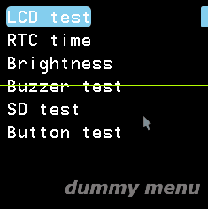
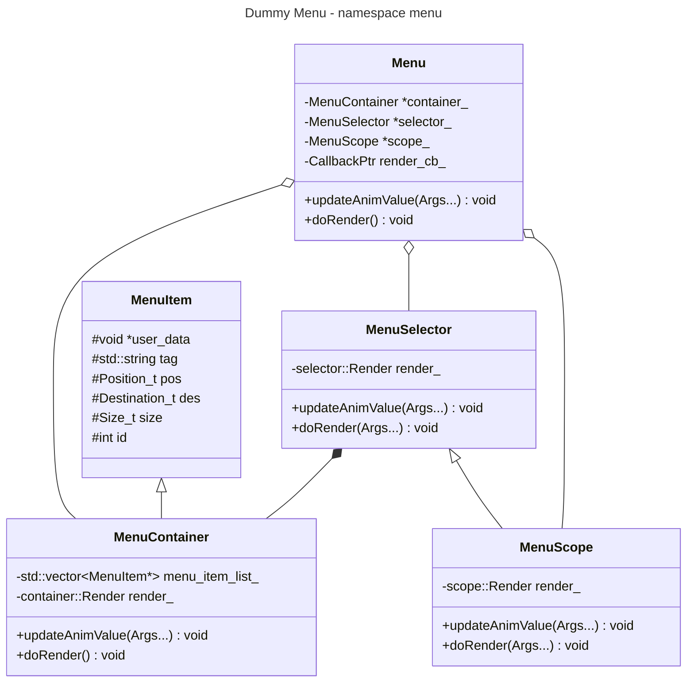
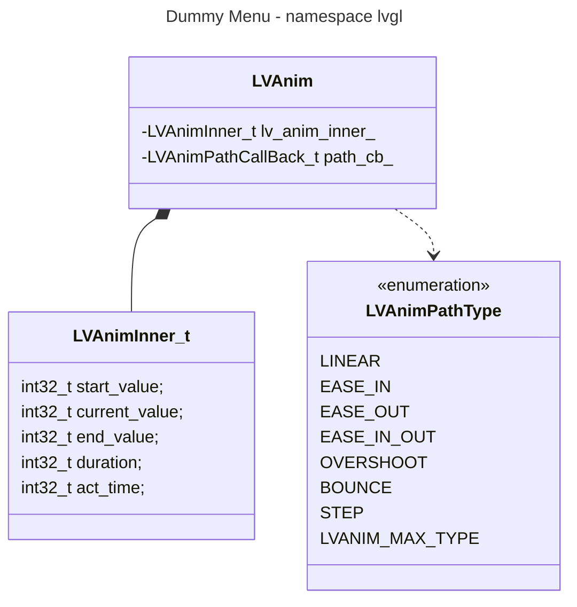

# Dummy Menu

A menu demo based on LovyanGFX SDL simulator.

Easing animation functions use the [lvgl](https://github.com/lvgl) `anim` content, packaged and simplified in this project.
> Thanks for [Forairaaaaa](https://github.com/Forairaaaaa) provided support.

<div class="snek" align="center">
    
</div>

## Prerequisite

- Ubuntu 20.04 or higher
- CMake
- Clang or GNU build toolchain
- SDL2

```bash
sudo apt-get update
sudo apt-get install -y build-essential libsdl2-dev
```

## Usage

I recommend you use `LLDB` or other debug adapter to run the program. Because the resource management of this program is weak that may result in abnormal program exit after you close the display window. If you stick by it, use `ps -ef | grep dummy_menu` to obtain the **PID** of this running program and kill it using `kill -9 OBTAINED_PID_VALUE`.

```bash
git clone https://github.com/HangX-Ma/dummy-menu.git
cd dummy-menu && git submodule init --update --recursive
cmake -B build
cmake --build build -j$(nproc)
# run the dummy menu!
./build/dummy_menu
```

Control the selector movement using arrow key &uarr;, &darr; and &rarr;.

## Concept and Details

```txt
menu
├── container.cpp
├── container.h     ' menu item container
├── display.cpp     ' SDL simulator setup and loop inner details
├── lv_anim.cpp
├── lv_anim.h       ' path animation
├── menu.cpp
├── menu.h          ' menu manager
├── scope.cpp
├── scope.h         ' menu scope monitor
├── sdl_main.cpp    ' SDL simulator main
├── selector.cpp
└── selector.h      ' menu selector
```

<div class="dummy menu uml" align="center">



</div>

The key structure of this dummy menu is the class `MenuItem` and `LVAnim`, which are the base of animation property update and render operations. `Menu` manages `MenuSelector`, `MenuScope` and `MenuContainer`. The three managed class have their unique role:

- `MenuSelector`: Point to the current selected menu item. It has four animation path callback functions, `x`, `y`, `width`, `height`. So that it supports smooth movement between different menu items, action animation of **press** or **release**, and further extendable features.

- `MenuScope`: This class inherits from `MenuSelector`. It imitates what `MenuSelector` does but also monitors the current menu area. If current selected item is out of bound, `MenuScope` will modify the displayed menu items to maintains the fixed number of items in the monitored area.

- `MenuContainer`: Both classes mentioned above owns the same `MenuContainer` because we store the same `MenuContainer`'s pointer in their private field. Animation value update also depends on the `MenuItem` that managed by `MenuContainer`. Therefore, functions `updateAnimValue` and `doRender` in fact ask you to give them the info of selected menu item, such as `Size(width, height)`, `Position(x, y)`, `selection changed(or not)` and etc.
> `LVAnim` actually copy the main structure and content of `lvgl`. If you want to learn more about it, look at [lv_anim.h](https://github.com/lvgl/lvgl/blob/master/src/misc/lv_anim.h) and [lv_anim.c](https://github.com/lvgl/lvgl/blob/master/src/misc/lv_anim.c). I also recommend you take a glance of [easings.net](https://easings.net/).

## License

MIT License
